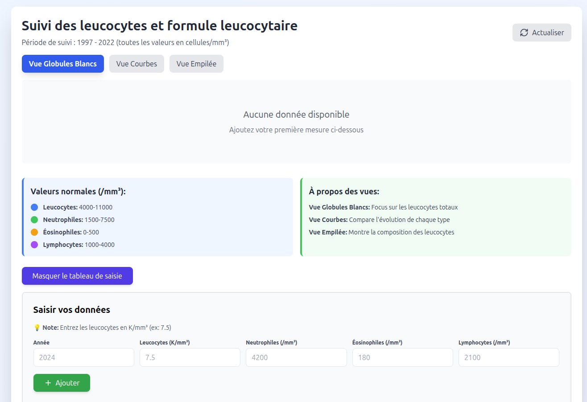
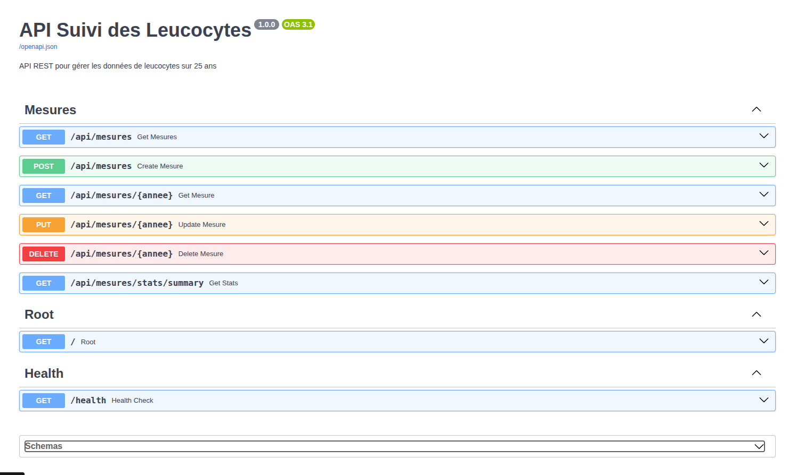

# 🩺 Leucocytes Tracking App


Application web pour suivre et visualiser l'évolution des leucocytes et de la formule leucocytaire avec un suivi mensuel.





## 🚀 Quick Start

### Prerequisites
- Docker & Docker Compose (recommended)
- OR: Python 3.9+ and Node.js 16+ with pnpm (for local development)

### Option 1: Docker (Recommended)

**Run the entire stack:**
```bash
docker compose up -d
```

**Rebuild after changes:**
```bash
docker compose down
docker compose build
docker compose up -d
```

**View logs:**
```bash
docker compose logs -f
```

**Stop the stack:**
```bash
docker compose down
```

### Option 2: Local Development

**Backend:**
```bash
cd backend
python -m venv venv
source venv/bin/activate  # Windows: venv\Scripts\activate
pip install -r requirements.txt
```

**Frontend:**
```bash
cd frontend
pnpm install
```

**Configuration** - Create `backend/.env`:
```env
APP_NAME="API Suivi des Leucocytes"
APP_VERSION="1.0.0"
DEBUG=True
DATABASE_URL="leucocytes.db"
CORS_ORIGINS=["http://localhost:3000", "http://localhost:5173"]
API_PREFIX="/api"
```

**Run Backend (Terminal 1):**
```bash
cd backend
source venv/bin/activate
uvicorn app.main:app --reload --host 0.0.0.0 --port 8081
```

**Run Frontend (Terminal 2):**
```bash
cd frontend
pnpm dev --host
```

### Access

- **Frontend:** http://localhost:3000
- **Backend API:** http://localhost:8081/docs
- **Network:** http://YOUR_LOCAL_IP:3000

## 🛠️ Tech Stack

**Backend:**
- FastAPI (Python)
- SQLite
- Pydantic
- Uvicorn

**Frontend:**
- React 18
- Vite
- Recharts
- Tailwind CSS

**Infrastructure:**
- Docker & Docker Compose
- Nginx (production frontend serving)

## 📁 Project Structure

```
leucocytes-project/
├── backend/
│   ├── app/
│   │   ├── database/
│   │   ├── models/
│   │   ├── routes/
│   │   ├── services/
│   │   └── main.py
│   ├── Dockerfile
│   ├── requirements.txt
│   └── .env (local dev only)
├── frontend/
│   ├── src/
│   │   ├── App.jsx
│   │   └── main.jsx
│   ├── Dockerfile
│   ├── nginx.conf
│   ├── package.json
│   └── vite.config.js
└── docker-compose.yml
```

## 📊 Features

- 📈 3 vues graphiques interactives (globules blancs, courbes, empilée)
- ➕ Saisie mensuelle des mesures (toutes les valeurs en /mm³)
- 🗑️ Suppression de mesures
- 🔄 Mise à jour en temps réel
- 📱 Design responsive
- 🌐 Accessible en réseau local

## 🧪 API Endpoints

```
GET    /api/mesures              # Liste toutes les mesures (filtres: ?annee=2024&mois=1)
POST   /api/mesures              # Créer une mesure
GET    /api/mesures/{id}         # Récupérer par ID
PUT    /api/mesures/{id}         # Mettre à jour une mesure
DELETE /api/mesures/{id}         # Supprimer une mesure
GET    /api/mesures/stats/summary # Statistiques
```




## 📝 License

